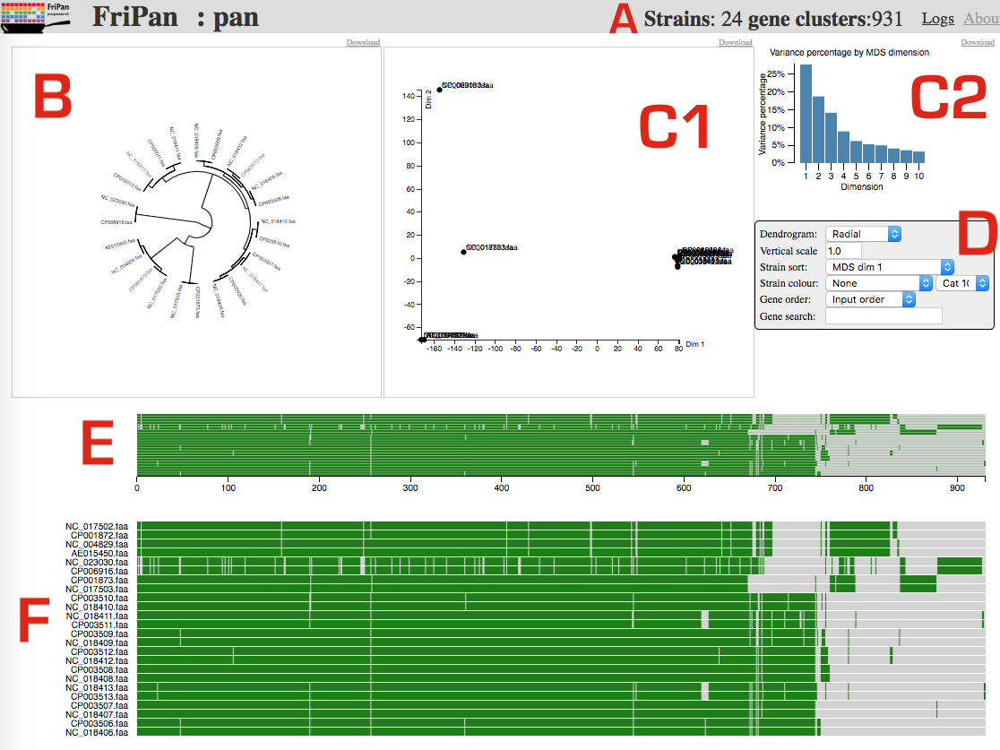

[](https://travis-ci.org/drpowell/FriPan)
[](https://opensource.org/licenses/MIT)


# FriPan

Interactive visualization of bacterial pan-genomes

## Introduction


FriPan is a web-based tool for exploring the pan-genome of multiple
bacterial genomes.  FriPan does not perform the ortholog clustering itself,
but it can load the output of [Roary](http://sanger-pathogens.github.io/Roary/) 
directly. Each genome is a row, and there is a columnar position for each gene cluster.  

## Installation

Ensure you have `npm` installed:
```
brew install npm          # MacOS Homebrew or Linuxbrew
sudo apt-get install npm  # Debian/Ubuntu/Mint
sudo yum install npm      # Redhat/Centos/Fedora
```

Install the code and build:
```
git clone https://github.com/drpowell/FriPan
cd FriPan
npm install
make compile
```

Run the demo code locally using our Python-based server in `server.sh`:
```
./server.sh
firefox http://localhost:8030/pan.html
```

Or make it publicly accessible using your `public_html` if your server is 
already running Apache:

```
# will put in $HOME/public_html/fripan by default, type 'make help' to see options
make install
firefox http://localhost/~user/fripan/pan.html
```

## The interface



### A : Menu bar

Tells you how many isolates were loaded and how many gene clusters across
those isolates, as well as links to error logs and software information.

### B: Gene presence/absence tree

This is **not** a phylogenetic tree. It is constructed from binary matrix
of gene presence/absence for each pair of gene cluster and isolate.
It dynamically changes depending on the selection in panel E/F.

### C1: MDS plot

This MDS plot is a dimensionality scaling plot (like PCA) which uses gene
presence/absence to group isolates with similar accessory genomes. Note
that core genome has no influence on this plot because those genes are
present in all the isolates. This panel also dynamically updates to 
represent the current selection in panel E/F.
    
### C2: MDS dimensions

This graph plots the percentage of the signal present in each of the MDS
dimensions. Ideally most of the signal will be in the first 2 dimensions 
which are shown in panel C1. You can click on any of the bars to change
which dimensions are displayed in panel C1.

### D: Display options 

These options allow you to configure how the pan-genome, tree and MDS plot
are displayed. You can re-order rows, annotate with colours etc. 

### E: Pan-genome overview

This panel will always show a zoomed out version of the whole pan-genome. 
The x-axis shows the gene clusters - here we see we have just over 900
clusters, which matches the 931 denoted in Panel A. It is possible to select
a region of this panel to zoom in on a smaller section of the pan-genome.

### F: Pan-genome

This panel provides a scrollable view of the pan genome itself. 
When zoomed in, each gene is visible as a block,
with width approximaltely proportional to the gene length.
Hovering over a gene will display information about that gene
that was present in the input files.

### G: Phylogenomic tree

Coming soon.

### H: Metadata columns

Coming soon.


## Input files

An example set of input files with the stem `test` is provided:

1. `test.proteinortho`
2. `test.descriptions`
3. `test.strains`

### XXX.proteinortho

This is the gene presence/absence matrix in TSV format. Each row
is a gene ortholog cluster, and each column in a strain. Each
cell in the matrix is gene ID, or `*` if none. Paralogs are CSV within
the cell. The first 3 columns are unused, but you must
use **the exact** names as below.

```
# Species   Genes   Alg.-Conn.   USA300    TW20      JKD6159
3           3       1            USA_001   TW20_001  JKD_001  
3           4       1            USA_002   TW20_002  JKD_002,JKD_004
2           2       1            USA_003   *         JKD_003 
1           1       1            USA_004   *         *
```

### XXX.descriptions

This maps gene IDs from the strain columns, in 2-column TSV format.

```
USA_001	      DNA replication protein
USA_002       hypothetical protein
USA_003       gyrase A
USA_004       alcohol dehydrogenase (EC:1.1.1.1)
TW20_001      DNA replication protein
TW20_002      unknown protein
JKD_001       DNA replication protein, dnaA
JKD_002       hypothetical protein
JKD_003       gyrase
JKD_004       hypothetical protein
```

### XXX.strains

This a multi-column TSV format. The first `ID` column links it with
the strains in the other two files. The remainign columns can be used
for colouring and ordering within the application.

```
ID        ST     Phenotype     Country    Colour
USA300    239    resistant     US         blue
TW20        2    suspectible   UK         green
JKD6159   239    resistant     AU         red
```

## Viewing multiple pan genomes

The included example input files all start with the stem/prefix `test`.
You can add as many pan-genomes to the fripan folder as you like,
just give each of them a different stem, say `mypop`. Then you just
append `?mypop` to the URL, so it looks like 
`http://example.com/~user/fripan/pan.html?mypop`.

To simplify this, just add each stem to the file called `pan.index`.
This will allow them to be selected via the `Index` menu item within
the application.

## Development

While developing code, it is useful to enable coffee in "watch" mode and
with source maps.  Run the following:
```
make debug
```

## Issues

Report feedback, suggestions and bugs on the [Issues page](https://github.com/drpowell/FriPan/issues)

## License

[MIT](https://raw.githubusercontent.com/drpowell/FriPan/master/LICENSE)

## Source

* Github: https://github.com/drpowell/FriPan
* Website: http://drpowell.github.io/FriPan/

## Authors

* [David Powell](https://twitter.com/d_r_powell)
* [Torsten Seemann](https://twitter.com/torstenseemann)

